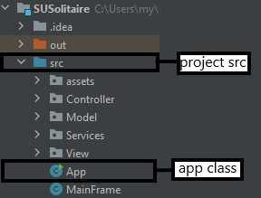
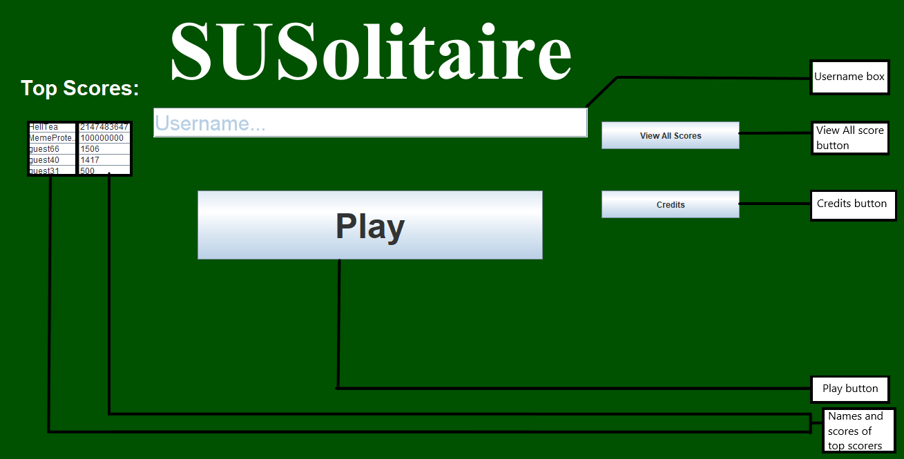
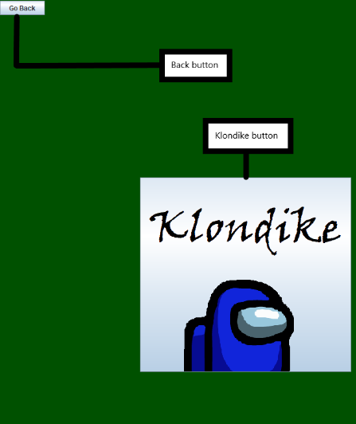
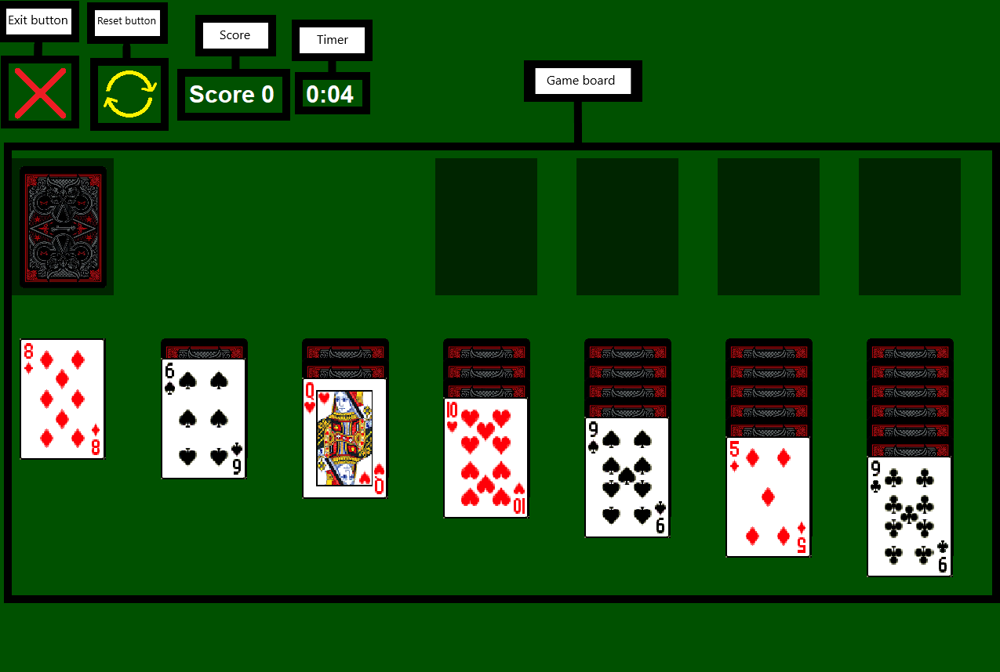

# SUSolitaire

##### This read me file contains all the needed information to play SUSolitaire.

## 1. Running the game 
To run the game you need to open the project named "src" and run the class named "App".

## 2. Main menu

From the main menu it is possible to access the game mode selection, credits and score screens and choose your username.

Username box: Lets you choose how what name will be saved after the game finishes

View All Score button: Brings up a window that shows all registered scores

Credits button: Does stuff

Names and scores of top scorers: Shows the names of the highest 5 played games, followed by their score

## 3. Game mode selection screen

From this screen you can select the game mode that you would like to play

Back button: go back to main menu

Klondike button: Play a game of Klondike

## 4. Klondike screen

This screen is where the game takes place

Exit button: return you to the mode selection screen

Reset button: resets the game

Score: shows your current score

Timer: shows for how long the current game has been played

Game board: It contains the stock, waste, foundation, tableau. Drag and drop cards to play

